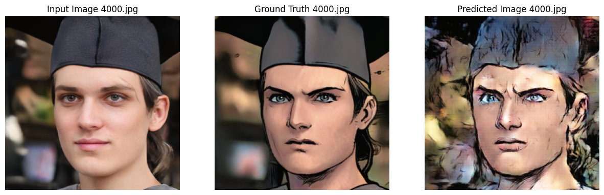
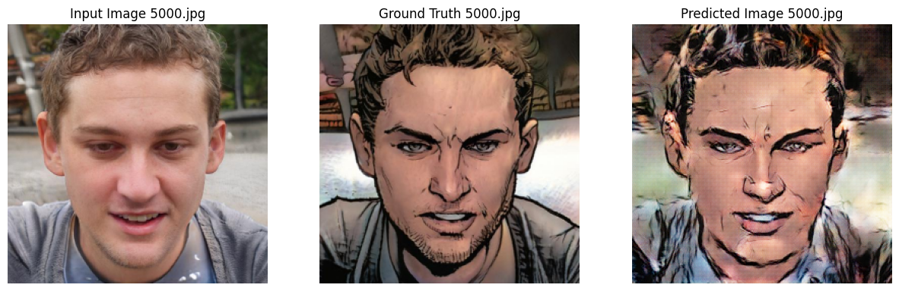
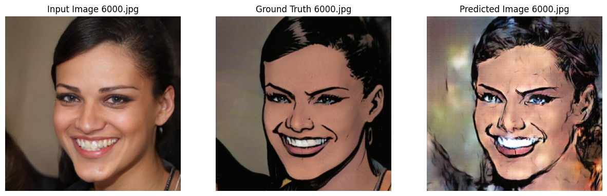

# Comic-Style-Image-Generator

Training and testing Pix2Pix GAN model to generate comic-style face images

### Results

### References

Dataset reference: https://www.kaggle.com/datasets/defileroff/comic-faces-paired-synthetic 
Model Reference: https://www.tensorflow.org/tutorials/generative/pix2pix
